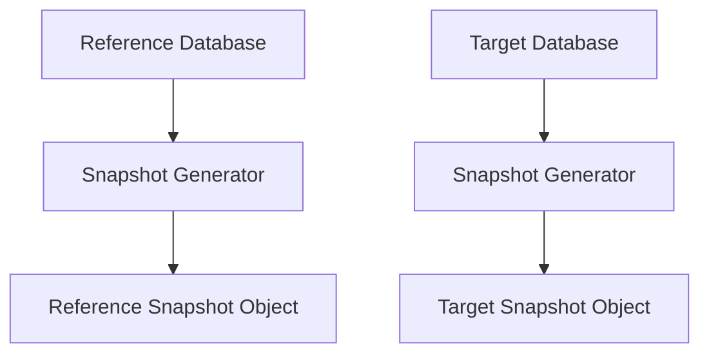
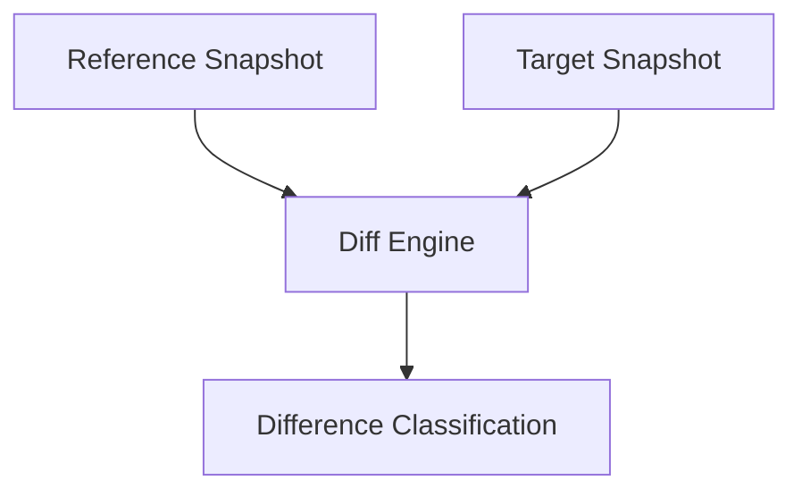
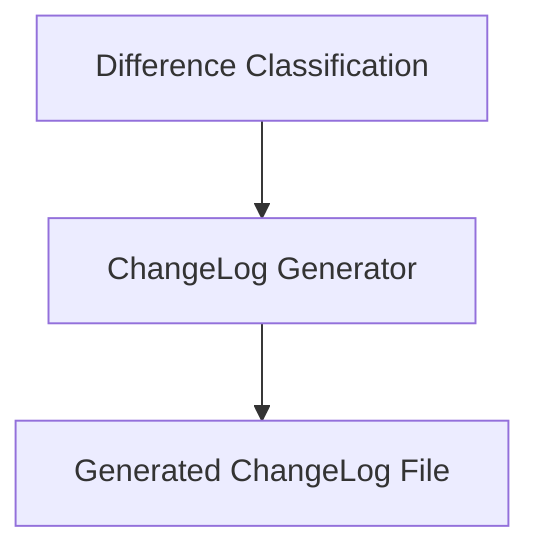
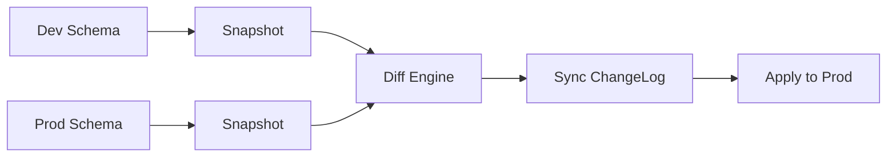
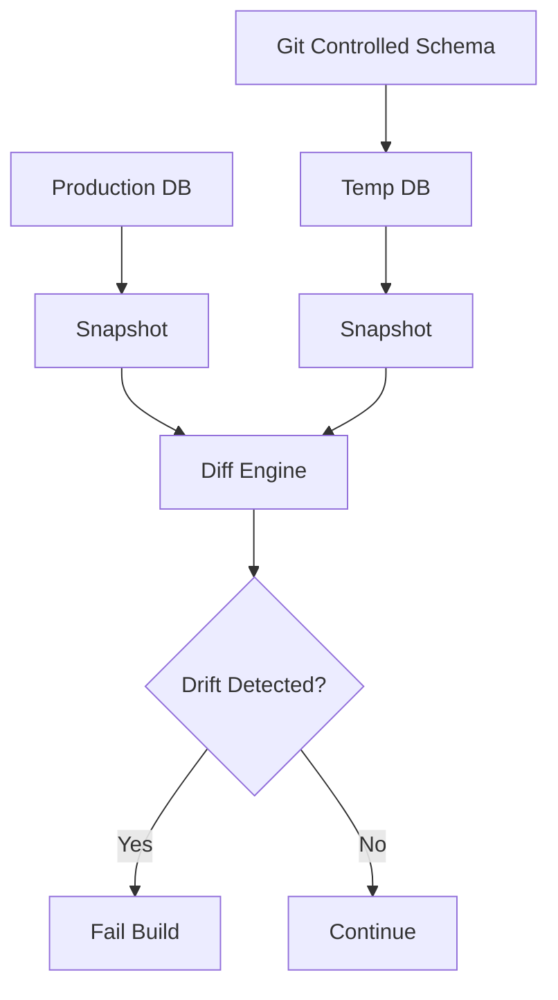

When I started formalizing Database DevOps practices, one recurring issue kept surfacing: **schema drift**.

Development was ahead of staging. Production had emergency hotfixes. QA sometimes had “just one small tweak” that never made it back to version control.Keeping schemas aligned across environments wasn’t just operational hygiene, it became foundational for reliability.

That’s where **Liquibase OSS** and specifically `diffChangelog` became a core part of my schema syncing strategy.

This article explains two things:

1. How I use `diffChangelog` for database schema synchronization
    
2. How it actually works internally using snapshots
    

Because understanding the mechanics changes how confidently you automate it.

## The Schema Sync Problem

In practice, schema syncing usually looks like one of these scenarios:

* Dev schema contains new tables not yet in staging
    
* Production has an index created manually during incident mitigation
    
* A column datatype differs across environments
    
* Constraints exist in one environment but not another
    

Traditional approaches involve manual inspection or ad-hoc SQL comparison scripts. Both are error-prone. With Liquibase OSS, I approach this differently. Instead of comparing raw SQL, I compare **database states**.

## The Command That Powers Schema Sync

Here’s the command I typically use:

```bash
liquibase diffChangelog \
  --referenceUrl=jdbc:postgresql://localhost:5432/dev \
  --url=jdbc:postgresql://localhost:5432/prod \
  --changeLogFile=schema-sync.xml
```

Conceptually:

* **Reference database** → Desired schema
    
* **Target database** → Actual schema
    
* Output → ChangeLog needed to align target with reference
    

But what’s happening under the hood?

## How diffChangelog Actually Works

The power of `diffChangelog` lies in Liquibase’s **snapshot engine**. It does not compare SQL files. It does not parse DDL text. Instead, it performs a structured, object-level comparison.

### Step 1: Snapshot Creation

Liquibase generates a **snapshot** of each database. A snapshot is an in-memory representation of schema metadata. This includes:

* Schemas
    
* Tables
    
* Columns
    
* Indexes
    
* Primary keys
    
* Foreign keys
    
* Unique constraints
    
* Sequences
    
* Views
    
* Data types
    

Here’s the lifecycle:



Liquibase queries database metadata (e.g., `information_schema` in PostgreSQL) and converts it into structured objects. Instead of raw SQL text, it now has two object graphs representing each schema.

### Step 2: Object Graph Comparison

Once both snapshots are built, Liquibase runs its diff engine.



Differences are categorized as:

* **Missing** → Exists in reference, not in target
    
* **Unexpected** → Exists in target, not in reference
    
* **Changed** → Exists in both but attributes differ
    

For example:

* A table in dev but not prod → Missing
    
* An index in prod but not dev → Unexpected
    
* Column length differs → Changed
    

This classification becomes the foundation for changelog generation.

### Step 3: ChangeLog Generation

Liquibase then converts differences into changeSets.



#### Example outputs:

If a table is missing:

```xml
<createTable tableName="orders">
   ...
</createTable>
```

If a datatype changed:

```xml
<modifyDataType tableName="users" columnName="email" newDataType="varchar(255)"/>
```

The result is a deployable changelog that synchronizes the target schema.

## How I Use This for Schema Syncing

Understanding the internal mechanics allows me to apply it confidently in real workflows.

### 1\. Environment Alignment (Dev → Staging → Prod)

When dev is the source of truth:



This ensures production moves forward predictably.

### 2\. Drift Detection in CI

I often run `diffChangelog` during CI to detect unauthorized drift :

1. Deploy known changelog to temp DB
    
2. Snapshot production
    
3. Compare
    
4. Fail pipeline if differences exist
    



This gives me governance without slowing velocity.

### 3\. Legacy Database Onboarding

For existing systems not yet version-controlled:

1. Snapshot production
    
2. Generate baseline changelog
    
3. Commit to Git
    
4. Transition into controlled migration model
    

`diffChangelog` becomes a bridge between unmanaged and managed schemas.

## Important Practical Lessons

Over time, I’ve learned several nuances.

### Snapshot Scope Matters

For large schemas, snapshot generation can be heavy.I use filters like:

```bash
--schemas=public
--includeObjects=table:users,index:users_email_idx
```

This keeps comparisons focused and performant.

### Not Every Difference Should Be Deployed

Auto-generated constraint names can differ across environments. Index naming strategies may vary. I always review generated changeLogs before applying them. Schema syncing is powerful but it must be deliberate.

### Snapshots Enable Determinism

The biggest realization for me was this - “`diffChangelog` is not comparing SQL text”. It is comparing structured schema models. That abstraction layer is what makes:

* Cross-database comparison possible
    
* CI automation reliable
    
* Drift detection accurate
    
* Schema syncing deterministic
    

Without snapshots, diffing would be brittle and vendor-specific.

## Why This Matters in Database DevOps?

Schema syncing is not just about keeping environments tidy. It enables:

* Predictable deployments
    
* Audit traceability
    
* Reduced incident risk
    
* Environment parity
    
* Controlled rollback strategies
    

Liquibase OSS gives me:

* Snapshot generation
    
* Object-level diffing
    
* ChangeLog generation
    
* Automated synchronization
    

All without requiring enterprise extensions.

## Final Thoughts

When I think about database schema syncing today, I no longer see it as a manual reconciliation process. I see it as:

1. Snapshot state
    
2. Compare object graphs
    
3. Generate delta
    
4. Apply controlled synchronization
    

`diffChangelog`, powered by snapshots, turns schema comparison into a structured, automatable workflow. And once I understood how it works internally, I stopped treating it as a convenience command and started treating it as a foundational component of my Database DevOps architecture.

If environment parity matters to you, understanding this mechanism is not optional. It is strategic.